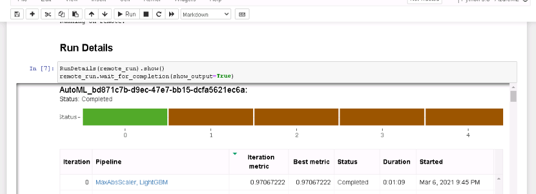
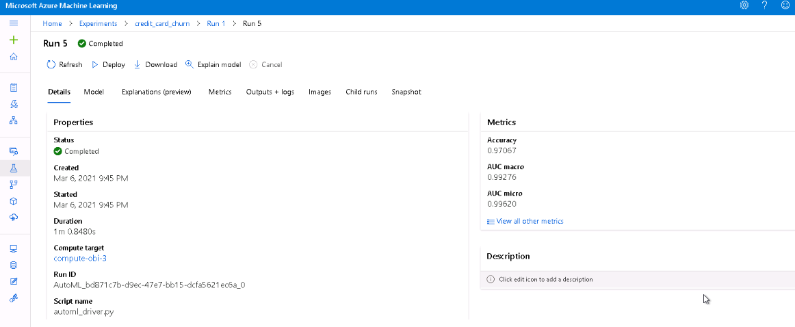
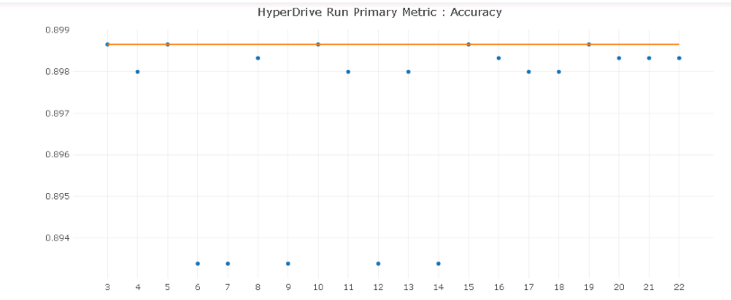
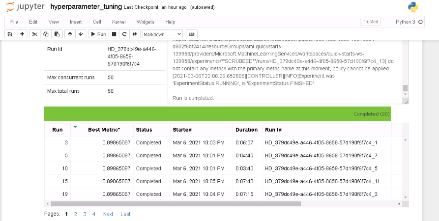
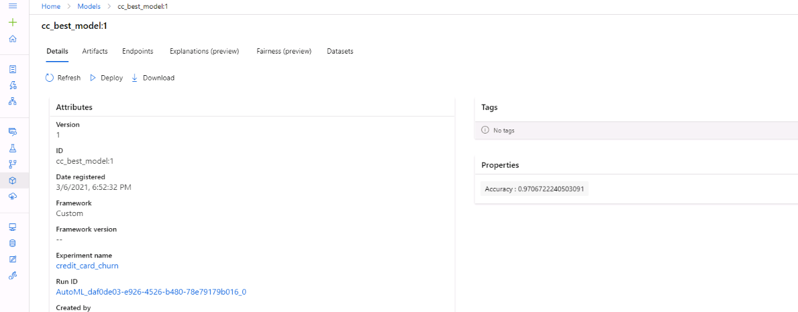
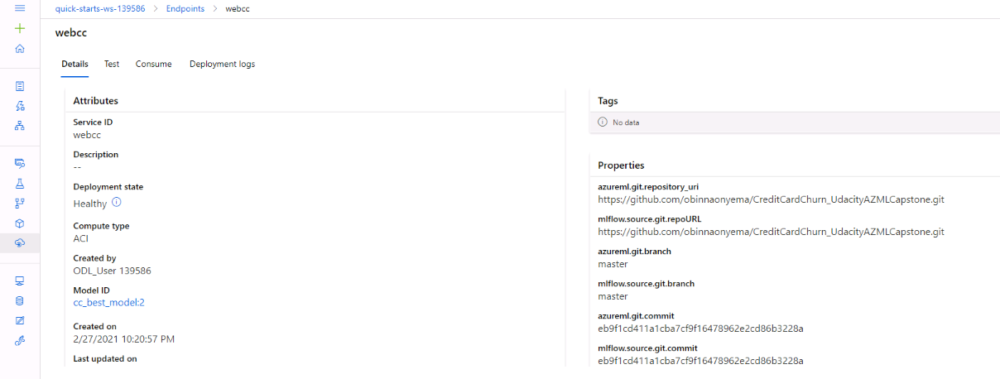

# Credit Card Churn

This is my chosen project for the Capstone Project in the Azure Machine Learning Engineer Nanodegree by Udacity. In this project, I attempt to build a model that will help a bank manager predict customers that are likely to churn. The manager's intention is to proactively engage these customers with a view to preventing churn. 

2 methods are used: one with Automated ML and one with the hyperdrive service. The better model is selected and deployed and sample requests are sent to the deployed endpoint.

## Table of Contents
* [Project Set Up and Installation](https://github.com/obinnaonyema/CreditCardChurn_UdacityAZMLCapstone#project-set-up-and-installation)
* [Dataset](https://github.com/obinnaonyema/CreditCardChurn_UdacityAZMLCapstone#dataset)
  * [Overview](https://github.com/obinnaonyema/CreditCardChurn_UdacityAZMLCapstone#overview)
  * [Task](https://github.com/obinnaonyema/CreditCardChurn_UdacityAZMLCapstone#task)
  * [Access to Data](https://github.com/obinnaonyema/CreditCardChurn_UdacityAZMLCapstone#access)
* [Automated ML](https://github.com/obinnaonyema/CreditCardChurn_UdacityAZMLCapstone#automated-ml)
  * [Results](https://github.com/obinnaonyema/CreditCardChurn_UdacityAZMLCapstone#results)
* [Hyperparameter Tuning](https://github.com/obinnaonyema/CreditCardChurn_UdacityAZMLCapstone#hyperparameter-tuning)
  * [Results](https://github.com/obinnaonyema/CreditCardChurn_UdacityAZMLCapstone#results-1)
* [Model Deployment](https://github.com/obinnaonyema/CreditCardChurn_UdacityAZMLCapstone#model-deployment) 
* [Screen Recording](https://github.com/obinnaonyema/CreditCardChurn_UdacityAZMLCapstone#screen-recording)
* [Future Work](https://github.com/obinnaonyema/CreditCardChurn_UdacityAZMLCapstone#future-work)


## Project Set Up and Installation

To run this experiment, try the following:
<ol>
  <li>Download this repository into your Azure ML Workspace. The raw data file is also provided in this repository.</li>
  <li>Set up your compute to run the jupyter notebook. You can use a DS2_V2 instance.</li>
  <li>Next you run each cell in the notebooks automl.ipynb, hyperparameter_tuning.ipynb. I ran each notebook one at a time to take note of the differences</li>
  <li>The notebooks contain the configuration to set up compute clusters for training the data.</li>
</ol>

This is the flow of the project as expected by the instructure:


## Dataset

### Overview

The data set was obtained from Kaggle [here](https://www.kaggle.com/sakshigoyal7/credit-card-customers). It contains details of credit card customers of a bank. There are 22 columns and 10000 rows. The last 2 columns were advised to be discarded by the data set provider which I have done in this project.

The data contains details such as education status, number of dependents, inactivity period, transaction counts, credit limits and so on. Our label is Attrition_Flag which says whether a customer is an existing customer or attrited customer.

### Task

The aim of the project is to predict the likelihood of churn, which is denoted by the records in the Attrition_Flag column of the raw data set. It is interesting to note that this dataset had some imbalance in the sense that only 1627 out of 10127 customers have churned.

### Access

I use TabularDatasetFactory class to download the data from my github repo. 

`cc_cust = TabularDatasetFactory.from_delimited_files(path=cc_data, separator=',')`

## Automated ML

I ran the experiment a few times using timeout settings of 20mins and 40mins but this was too short for any child runs to start. I set experiment_timeout_minutes to 60 so as to allow significant time for training of a few child models. Primary metric used is accuracy and exit score of 0.95 to prevent continued runs when no significant improvement is happening to the score. I tried to set a metric exit score as after a few attempts at running the experiment I noticed the score doesn't improve much after the first 5 child runs.

### Results

Accuracy score was 0.97 for the best model. I ran the experiment more than one noticing that each time the accuracy score was different. Perhaps the difference in compute resources may have influenced the outcome. 

The image below shows run details:



This shows the best model:





Here are the parameters of the best model
```
LightGBMClassifier
{'boosting_type': 'gbdt',
 'class_weight': None,
 'colsample_bytree': 1.0,
 'importance_type': 'split',
 'learning_rate': 0.1,
 'max_depth': -1,
 'min_child_samples': 20,
 'min_child_weight': 0.001,
 'min_split_gain': 0.0,
 'n_estimators': 100,
 'n_jobs': 1,
 'num_leaves': 31,
 'objective': None,
 'random_state': None,
 'reg_alpha': 0.0,
 'reg_lambda': 0.0,
 'silent': True,
 'subsample': 1.0,
 'subsample_for_bin': 200000,
 'subsample_freq': 0,
 'verbose': -10}
```

In the future, I would like to see if letting the experiment run for multiple hours will yield much better results. Also, testing to see how increasing the number of cross-validations or using a larger data set may reduce bias. 


## Hyperparameter Tuning

Logistic Regression algorithm from the ScikitLearn library was used for the HyperDrive Experiment. These parameters were set up:

<ul>
<li> C determines the strength of the regularization: higher values of C mean less regularization. I used the values (1, 2, 3, 4) </li>
<li> max_iter which is the number of iterations over the entire dataset. I used the values (40, 80, 120, 130, 200)</li>
<li> Random Sampling allowed us optimize resource usage.</li>
</ul>

### Results

The HyperDrive experiment yielded an accuracy score of 0.8986 with regularization parameter of 4 and max iteration of 200.

In the future, I would like to test improving the experiment by using a different sampling technique.

The image below shows run details with the run in progress:



This shows best run:


## Model Deployment

The best model was registered and deployed. I chose to deploy the AutoML model. Inference config was setup to handle the deployment environment and scoring. A container instance with 1 CPU core and 1gb RAM sufficient for development operation was set up.



A sample JSON payload was created from 5 rows of the original data set. With this I called the model endpoint for scoring.

I chose 5 rows of data to make up the parameters of the JSON request payload. Then I compared the response to the values in Attrition_Flag from the original dataset. The code detailing this is in the AutoML notebook.

Here are the endpoint details showing it in healthy state:



## Screen Recording

You may view my screen cast [here](https://youtu.be/dwEIDuCOSfw). I have run through the tasks briefly demonstrating with the files on my github repo.


## Future Work

I would like to work with a larger data set, and experiment with other sampling methods as well enable app insights if the model were to be used in a production environment.
